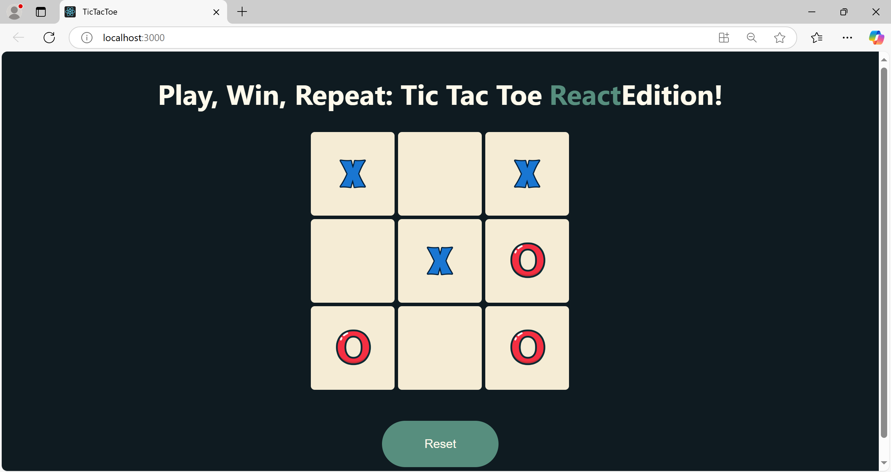

# Tic Tac Toe Game

This is a simple implementation of the classic **Tic Tac Toe** game built with **React**. The game allows two players to play alternately on a 3x3 grid.

## Features

- Two-player mode: Play alternately with a friend.
- Real-time game state update.
- Visual indication for the winning line.
- Reset option to start a new game.

## Demo

  
